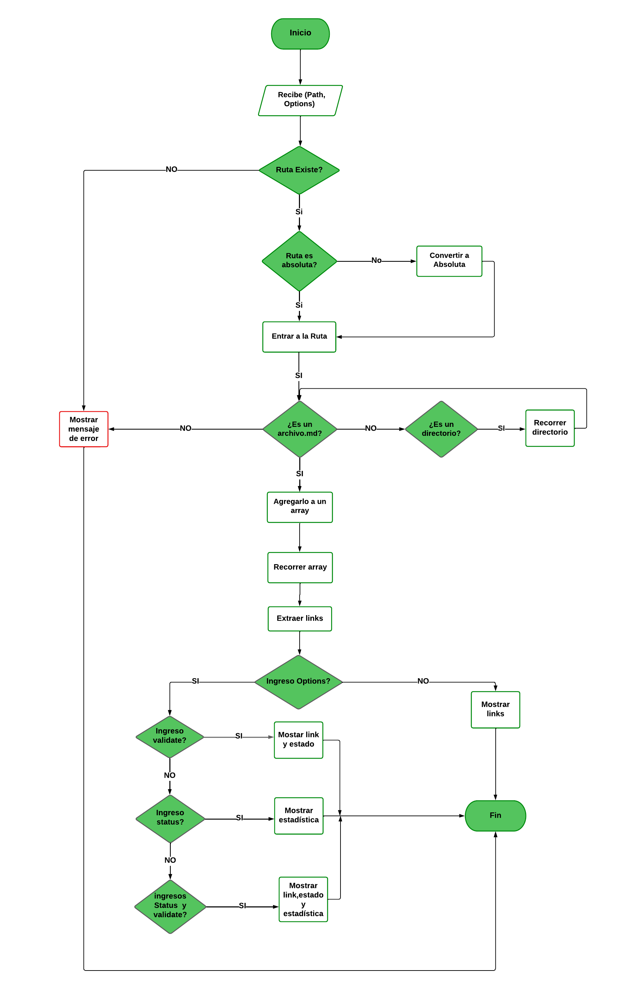
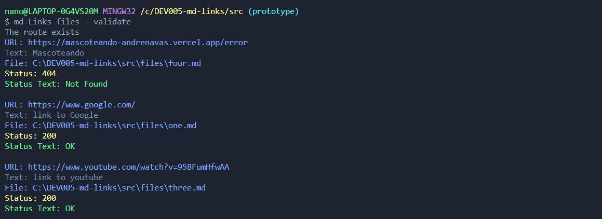
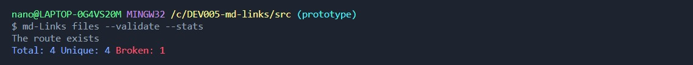

 # Markdown Links

## Índice

* [1. Preámbulo](#1-preámbulo)
* [2. Resumen del proyecto](#2-resumen-del-proyecto)
* [3. Diagrama de Flujo](#1-preámbulo)
* [4. Requisitos y Especificaciones Técnicas](#1-preámbulo)
* [5. Guía de Uso e instalación de la Librería](#1-preámbulo)
* [6. Checklist](#6-checklist)

***

## 1. Preámbulo

[Markdown](https://es.wikipedia.org/wiki/Markdown) es un lenguaje de marcado
ligero muy popular entre developers. Es usado en muchísimas plataformas que
manejan texto plano (GitHub, foros, blogs, ...) y es muy común
encontrar varios archivos en ese formato en cualquier tipo de repositorio
(empezando por el tradicional `README.md`).Estos archivos `Markdown` normalmente contienen _links_ (vínculos/ligas) que
muchas veces están rotos o ya no son válidos y eso perjudica mucho el valor de
la información que se quiere compartir.

## 2. Resumen del proyecto

mdLinks es una herramienta de línea de comandos desarrollada en Node.js que te permite analizar archivos Markdown y extraer información sobre los enlaces presentes en ellos.
mdLinks ofrece estas principales características:

* Información detallada: Verificando la válidez de cada enlace de archivo Markdow y proporcionando detalles como la URL, el texto y el estado de cada enlace.

* Ahorro de tiempo: Con mdLinks, puedes analizar rápidamente tus archivos Markdown y obtener información sobre los enlaces sin tener que hacerlo manualmente.

## 3. Diagrama de Flujo: mdLinks
El siguiente diagrama de flujo representa el proceso de funcionamiento de la herramienta mdLinks. Proporciona una visión general de las principales etapas y acciones que se llevan a cabo durante su ejecución.

_Diagrama de flujo con opciones_

## 4. Requisítos y Especificaciones Técnicas
Para la construcción de esta librería, se utilizaron las siguientes herramientas y dependencias:

#### Ejecución
Node.js: Entorno de desarrollo de JavaScript.

#### Dependencias

* JSDOM: Librería para manipular y analizar el DOM en Node.js.
* Colors: Librería para agregar color y estilo a la salida en la consola.
* Node-fetch: Librería para realizar solicitudes HTTP desde Node.js.
* Eslint: Herramienta para identificar patrones encontrados en código ECMAScript / JavaScript.
* Jest: Framework de JavaScript para los test unitarios.

#### Módulos

* fs: Permite manejar los archivos del sistema.
* path: Proporciona trabajar con rutas de archivos y directorios.
* process: Proporciona información y control sobre el proceso de Node.js actual.

## 5. Guía de Uso e instalación de la Librería

###  Instalación

A continuación, te explicare cómo instalar la librería en tu proyecto:

1. Abre una terminal y navega hasta el directorio de tu proyecto.
2. Ejecuta el siguiente comando: npm install  `sofia-torres-v/DEV005-md-links`

### Modo de Uso Básico

El ejecutable de nuestra aplicación puede ejecutarse de la siguiente manera a través de la terminal:

En el primer caso, si el usuario simplemente ingresa el siguiente comando en la terminal :
   
   `md-links <path-to-file-or-directory> `

##### El valor de retorno será

* `href`: URL encontrada.
* `text`: Texto que aparecía dentro del link (`<a>`).
* `file`: Ruta del archivo donde se encontró el link.

##### Captura de Pantalla: Ejemplo de Retorno en la Terminal:

### Modo de Uso con ingreso de Opciones

En el segundo caso, si el usuario ingresa en la termina la ruta y la opción --validate :
 
  `mdLinks <path-to-file-or-directory> --validate`

##### El valor de retorno será

* `href`: URL encontrada.
* `text`: Texto que aparecía dentro del link (`<a>`).
* `file`: Ruta del archivo donde se encontró el link.
* `status`: Código de respuesta HTTP.
* `statusText`: Mensaje `Not Found`en caso de fallo u `OK` en caso de éxito.

##### Captura de Pantalla: Ejemplo de Retorno en la Terminal:

En el tercer caso, si el usuario ingresa en la termina la ruta y la opción --stats :

`mdLinks <path-to-file-or-directory> --stats`

##### El valor de retorno será

* `Total`: Número de links encontardos.
* `Unique`: Número de links que no se repiten.

##### Captura de Pantalla: Ejemplo de Retorno en la Terminal:

 
En el cuarto y último caso, si el usuario ingresa en la termina la ruta y las opciones --stats --valiate :

`mdLinks <path-to-file-or-directory> --stats --validate`

También acepta el siguiente orden

`mdLinks <path-to-file-or-directory>  --validate --stats`

##### EL valor de retorno será

* `Total`: Número de links encontardos.
* `Unique`: Número de links que no se repiten.
* `Broken`: Número de links que no son válidos.

##### Captura de Pantalla: Ejemplo de Retorno en la Terminal:

 
## 6. Checklist

### General

* [X] Puede instalarse via `npm install --global <github-user>/md-links`

### `README.md`

* [X] Un board con el backlog para la implementación de la librería.
* [X] Documentación técnica de la librería.
* [X] Guía de uso e instalación de la librería

### API `mdLinks(path, opts)`

* [X] El módulo exporta una función con la interfaz (API) esperada.
* [X] Implementa soporte para archivo individual
* [X] Implementa soporte para directorios
* [X] Implementa `options.validate`

### CLI

* [x] Expone ejecutable `md-links` en el path (configurado en `package.json`)
* [X] Se ejecuta sin errores / output esperado
* [x] Implementa `--validate`
* [X] Implementa `--stats`

### Pruebas / tests

* [X] Pruebas unitarias cubren un mínimo del 70% de statements, functions,
  lines, y branches.
* [X] Pasa tests (y linters) (`npm test`).

### Desplegado en NPM

